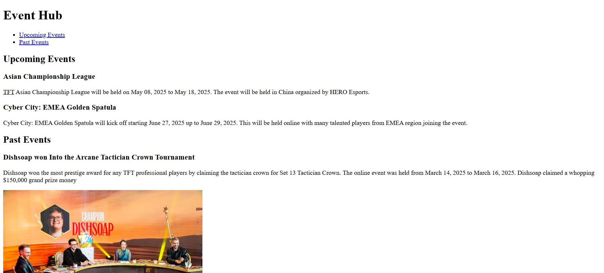

# 💻 Event Hub

## ℹ️ A TeamFight Tactics event hub page

A fully responsive event listing webpage showcasing past and upcoming TeamFight Tactics tournaments. Created as part of the [freeCodeCamp.org](https://www.freecodecamp.org/learn/full-stack-developer/) HTML5 free course.

---

## 🔍 Overview

This project mimics a centralized event listing page for TeamFight Tactics events. It presents information clearly using semantic HTML and includes Open Graph tags for social previews. It demonstrates the use of meta tags, responsive design techniques, and thoughtful accessibility attributes.

---

## ✨ Features

- Responsive layout using media queries
- Semantic HTML5 structure for accessibility
- Open Graph meta tags for link previews
- ARIA landmarks and roles for screen readers
- Custom favicon and social sharing thumbnail
- Descriptive and SEO-friendly `<meta>` tags

---

## 🧠 What I Learned

- How to create a solid `<head>` section with useful and valid metadata
- How Open Graph tags enhance social media link previews
- Importance of ARIA roles and semantic elements in screen reader navigation
- How to use base64-encoded images for favicon and preview in a single-page context

---

## 🛠️ Tech Used

- HTML5
- Git
- GitHub
- Netlify

---

## 🚀 How to Run

1. Clone the repository
2. Open `index.html` in your browser

---

## 🌐 Live Demo

Or you can check out the 👉 [live website here](https://event-hub-page-fcc-jiro.netlify.app/)

---

## 🧑‍💻 Author

Created by **Elmar Chavez**

🗓️ Month/Year: **April 2025**

📚 Journey: **1st** month of learning _frontend web development_.
